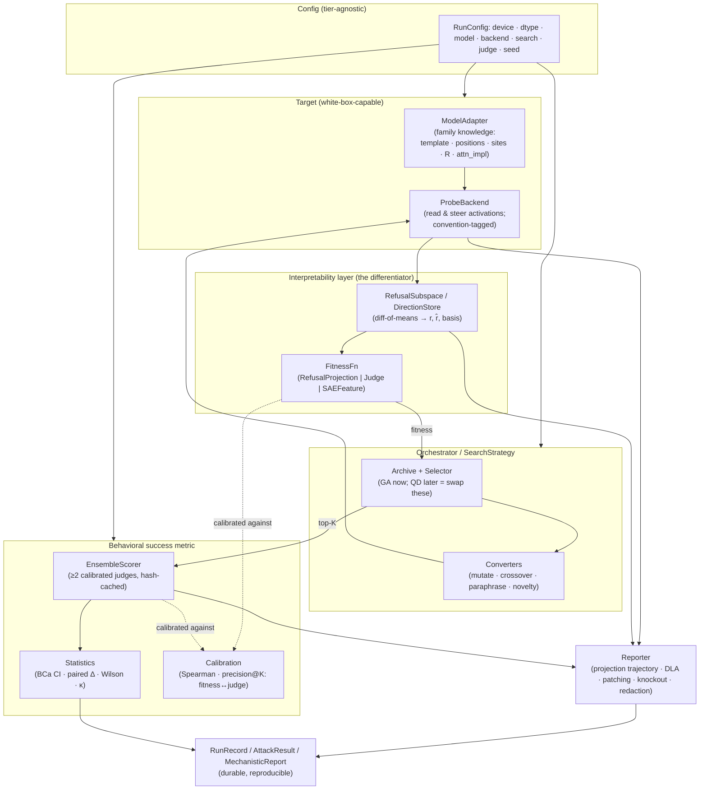
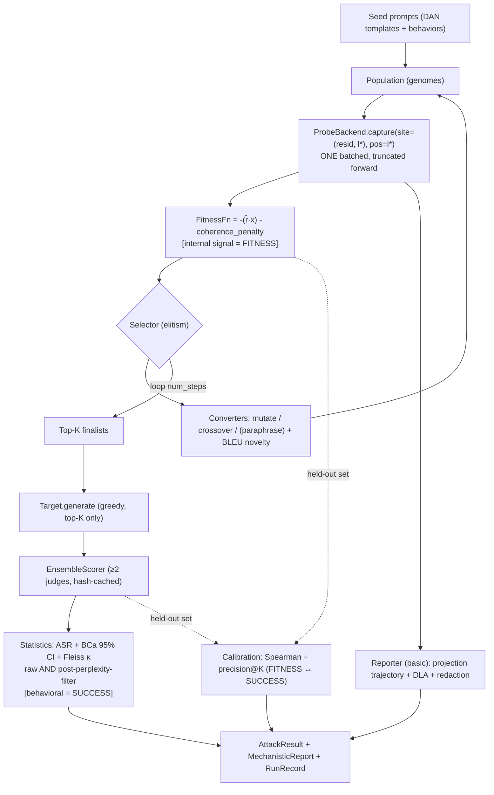

# Baku — Architecture

> **Baku** is an *interpretability-native* automated red-teaming / fuzzing framework for auditing open-weight LLMs.
> Where PyRIT / Garak / FuzzyAI treat the target as a black box (send text → read text → a judge decides), Baku reads the
> target's **internal signals** (refusal-direction projection, SAE feature activations, attention/attribution) and uses
> them **both** as the attack-search fitness function **and** as the source of a mechanistic "why it worked" report.

This document is the canonical architecture reference. See also:
- [`IMPLEMENTATION.md`](IMPLEMENTATION.md) — phased build plan, per-component notes, reference code, ordered build checklist.
- [`TESTING.md`](TESTING.md) — test strategy + the TDD path.
- [`CONCEPTS_COVERED.md`](CONCEPTS_COVERED.md) — the teaching-dial ledger.

> **Authorship rule:** these `docs/` files and `CLAUDE.md` are authored by the mentor (Claude). All **project source**
> under `src/baku/`, `tests/`, and `configs/` is hand-written by the researcher. Code in these docs is *reference to study
> and reimplement*, not the project's source.

---

## 1. Design principles (the load-bearing decisions)

These were forced by an adversarially-verified research sweep; violating one tends to produce a *plausible-but-wrong* result.

1. **FITNESS ≠ SUCCESS METRIC.** The refusal-projection scalar `r̂·x` is a *useful but gameable, non-monotone proxy* —
   neither necessary nor sufficient for a behavioral jailbreak. So:
   - **Fitness** (cheap internal signal) drives the inner search loop.
   - **Success metric** (behavioral ensemble judge + bootstrap CIs) is the *only* thing used to report ASR.
   - A **calibration stage** measures Spearman rank-correlation + precision@K between fitness and judge per
     `(model, layer, position)`. Internal-signal-gated ASR is trusted only after calibration shows adequate correlation.
   - The inner loop is **coherence-constrained** (KL-on-harmless `< ~0.1` or a perplexity bound) so the optimizer can't
     Goodhart it into incoherent text. Prefer **prompt-space** (bounded perplexity) over raw activation-space optimization.
2. **Refusal is a 2–5D concept cone, not a single line.** `RefusalSubspace` is first-class from day one: 1-D fast default
   (Arditi difference-of-means) locally, a small 2–5D basis on cloud — *same type*, a config flip. Don't hardcode strict
   orthonormality; select by representational independence. Probe/gradient-derived directions eventually beat diff-of-means.
3. **Per-run convention consistency — NOT one global backend.** "One convention" means: within a *single run*, extraction +
   fitness + intervention + reporting all use the SAME backend + activation convention, and that convention is verified to
   match the SAE training distribution before any SAE-derived signal is trusted. Different *targets* may use different
   backends. See [§5 Backend & Convention Policy](#5-backend--convention-policy).
4. **bf16 for Gemma, always.** fp16 + dropped attention soft-cap → garbage logits. Keep `r̂` as an fp32 master + an
   activation-dtype working copy.
5. **No convention-defining global default backend; selection is per-target** (behind `ProbeBackend` / `SAEProvider`).
6. **SAE-feature fitness is secondary / cloud-leaning for the 2B target.** No native Gemma-2-2B-**IT** residual SAE exists;
   PT→IT transfer is plausible but unvalidated for refusal features. Phase-1 white-box signal = **refusal projection**.
   SAE is a flagged-risk later add, gated by the SAE-activation correctness test. JumpReLU gate `z·H(z−θ)` is mandatory.
7. **Tier split is a configurable VRAM budget, not a fixed "≥2B = cloud" rule.** Gradient attacks (GCG/SSR/RAID) are
   quarantined behind a `GradientAttack` interface (they need a backward pass) — but *where* they run is budget-driven.
8. **Tier switching is pure config, never branching algorithm logic.** Same attack/probe/report code on laptop and cloud;
   only config (device, dtype, backend, remote flag, `n_directions`, batch / `search_width`, enabled attacks) differs.

---

## 2. System overview



The **interpretability layer** (`ProbeBackend` → `RefusalSubspace` → `FitnessFn`) is what no existing tool has. Everything
else mirrors PyRIT's vocabulary so the surface is legible to security engineers.

---

## 3. Component model

| Component | PyRIT analog | Responsibility |
|---|---|---|
| `Target` | PromptTarget | Loads model + generates; white-box-capable (wraps `ModelAdapter` + `ProbeBackend`). |
| `ProbeBackend` *(novel)* | — | Device/model-agnostic **read & steer** of activations at logical sites; per-arch site→module-path registry; memory-disciplined; **tags every capture with its convention**. Per-target impls. |
| `ModelAdapter` *(novel)* | — | Isolates all family-specific knowledge: chat template, negative-indexed `post_instruction_positions`, residual sites, refusal-token set `R`, orthogonalization matrices, soft-cap/RMSNorm quirks, `attn_implementation`. Synthetic template for no-template base models. |
| `RefusalSubspace` / `DirectionStore` *(novel)* | — | Serializable refusal artifact; holds `r`, `r̂`, a `basis` (1-D→2–5D), diagnostics, a **convention tag**, calibration metrics. |
| `FitnessFn` (protocol) *(novel)* | — | Per-candidate scalar(s) from internal signals; decouples search from any judge. Returns scalar **and** raw activations. Carries `is_differentiable`. |
| `SAEProvider` *(novel, later)* | — | Load/evict SAEs (`SAE.from_pretrained` + JumpReLU fallback); VRAM lifecycle; **hard SAE-activation correctness gate**. |
| `Converter` | PromptConverter | Genetic operators (mutation, multi-point crossover, paraphrase, synonym) + novelty/BLEU filter; boundary-aware token round-trip. |
| `Orchestrator` / `SearchStrategy` | Orchestrator | One population loop (init→score→select→convert→archive). GA now, QD later = swap Selector + Archive (+`descriptor_fn`). |
| `Scorer` / `EnsembleScorer` | Scorer | Behavioral success metric; ≥2 heterogeneous calibrated judges; per-judge results retained; hash-cached. |
| `Statistics` *(novel)* | — | BCa bootstrap CI on ASR, paired-bootstrap Δ-ASR, Wilson interval, Cohen's/Fleiss' κ + base rate. |
| `Calibration` *(novel)* | — | Spearman + precision@K bridging fitness ↔ judge. |
| `Reporter` *(novel)* | — | Mechanistic report from the attack's hooks + redaction layer. |
| Datasets / Results | memory/datasets | Runtime-fetch eval sets behind an acknowledgement flag; reproducible run/result records. |

### 3.1 Key interfaces (reference / illustrative — you implement these)

```python
# ---- probes/base.py -------------------------------------------------------
from abc import ABC, abstractmethod
from dataclasses import dataclass
from typing import Protocol, runtime_checkable
import torch

Site = tuple[str, int]          # ("resid_post", 12)  — logical, backend-agnostic

@dataclass(frozen=True)
class Convention:
    backend: str                # "hooked_sae_transformer" | "hf_hooks" | "nnsight" | "sae_bridge"
    processing: str             # "raw" (no_processing) | "folded_centered"
    model_revision: str         # HF commit / tag — pins reproducibility

class ProbeBackend(ABC):
    convention: Convention

    @abstractmethod
    def capture(self, inputs, sites: list[Site]) -> dict[Site, torch.Tensor]:
        """Run ONE forward pass capturing ONLY `sites`. Detach + move off-GPU per policy.
        Never cache-all. Returned tensors are tagged with self.convention."""

    @abstractmethod
    def steer(self, inputs, interventions: "list[Intervention]"):
        """Forward pass with hook-based interventions (ablation / addition)."""

    @abstractmethod
    def generate(self, inputs, interventions=None, **gen_kwargs) -> list[str]: ...

    @abstractmethod
    def resolve_site(self, site: Site) -> str:
        """Logical Site -> concrete module path / TL hook name for THIS backend."""


# ---- adapters/base.py -----------------------------------------------------
class ModelAdapter(ABC):
    attn_implementation: str        # "eager" for Gemma-2 (never flash_attention_2)

    @abstractmethod
    def apply_chat_template(self, instruction: str, system: str | None = None) -> str: ...

    @abstractmethod
    def post_instruction_positions(self) -> list[int]:
        """Negative indices into the post-template tokens (e.g. [-1, -2, -5])."""

    @abstractmethod
    def site_to_hook(self, site: Site) -> str: ...

    @abstractmethod
    def refusal_token_set(self) -> list[int]:
        """Token ids R for the cheap logit refusal_metric (family-specific)."""

    @abstractmethod
    def orthogonalization_matrices(self, model) -> "list[torch.nn.Parameter]":
        """embed + every attn o_proj + every MLP down_proj — for weight orthogonalization."""


# ---- directions/subspace.py ----------------------------------------------
@dataclass
class RefusalSubspace:
    model_id: str
    template_hash: str
    layer: int
    position: int
    r: torch.Tensor          # raw diff-of-means (magnitude-carrying)  — for activation ADDITION
    r_hat: torch.Tensor      # unit vector                              — for ablation + projection
    basis: torch.Tensor      # [k, d_model]; k=1 local, 2..5 cloud
    diagnostics: dict        # {"bypass": float, "induce": float, "kl_harmless": float}
    convention: Convention
    calibration: dict | None = None   # {"spearman": float, "precision_at_k": float}

    def project(self, x: torch.Tensor) -> torch.Tensor:
        """Scalar (k=1) or vector (k>1) projection of activations onto the subspace."""


# ---- fitness/base.py ------------------------------------------------------
@dataclass
class FitnessResult:
    scores: torch.Tensor                 # [batch] lower == "less refusing" by convention
    activations: dict[Site, torch.Tensor] | None   # reused by the Reporter

@runtime_checkable
class FitnessFn(Protocol):
    is_differentiable: bool
    def __call__(self, prompts: list[str]) -> FitnessResult: ...


# ---- scorers/base.py ------------------------------------------------------
@dataclass
class JudgeResult:
    judge_id: str
    score: float            # [0, 1]
    label: bool             # score >= threshold
    threshold: float
    raw: dict

class Scorer(ABC):
    judge_id: str
    @abstractmethod
    def score(self, prompt: str, response: str, context: dict | None = None) -> JudgeResult: ...


# ---- orchestrators/base.py ------------------------------------------------
class SearchStrategy(ABC):
    @abstractmethod
    def run(self) -> "AttackResult":
        """init_population -> (loop: score via FitnessFn -> Selector -> Converters -> Archive)
        -> confirm top-K via EnsembleScorer -> attach Statistics + MechanisticReport."""
```

---

## 4. The core attack loop (data flow)



Two rules visible in the loop:
- **The inner loop never calls a text judge** — it only reads internal activations (cheap, batched, no decoding). The judge
  runs once on the **top-K finalists** to produce the reported ASR.
- **Calibration is the bridge** that earns the right to claim the internal signal meant anything. No adequate
  Spearman/precision@K ⇒ we don't report internal-signal-gated ASR for that `(model, layer, position)`.

---

## 5. Backend & Convention Policy

The single subtlety that, if gotten wrong, silently corrupts every interpretability signal. (Verified against current
SAELens / TransformerLens docs, June 2026.)

- **Standardize on raw activations.** `from_pretrained_no_processing` (≡ `fold_ln=False, center_writing_weights=False,
  center_unembed=False`), raw-HF hooks, and `TransformerBridge`-default all yield the **same raw-activation space** the
  Gemma Scope SAEs were trained on. **Forbidden:** mixing those with legacy `from_pretrained` *default* (folded + centered).
- **Per-target backend selection** (behind `ProbeBackend` / `SAEProvider`):

  | Target class | Backend | Loader |
  |---|---|---|
  | Legacy-supported (Gemma-2, GPT-2, …) | `HookedSAETransformer` / `HookedTransformer` | `from_pretrained_no_processing` — SAE-validated, mature |
  | Newer arch (Gemma-3+) | `SAETransformerBridge` | `boot_transformers(...)` — TL v3 **beta**, pinned `transformer-lens>=3.0.0b0` |
  | Any / gated / custom | raw-HF hooks | `AutoModelForCausalLM.from_pretrained(..., attn_implementation="eager")` |
  | Cloud scale / remote | nnsight | `LanguageModel(...)` / NDIF — pin exact version |

  `TransformerBridge` is kept as a general backend (broad coverage + HF-matching numerics for the fidelity test) but is
  **not** the convention-defining default.
- **Adopt the SAE-correct convention NOW** (Phase 1, even with no SAE): extract Gemma-2-2B-IT directions under
  `HookedSAETransformer.from_pretrained_no_processing` so `RefusalSubspace` artifacts already live in the Gemma Scope space.
- **Convention tagging is an enforced invariant.** Every `RefusalSubspace` / SAE artifact records its `Convention`. The
  loader **raises** rather than combine an artifact with a run under a different convention.
- **Two distinct fidelity tests** (see TESTING.md):
  - **Backend correctness** — TL logits ≈ raw-HF logits, *per-backend tolerance* (legacy `HookedTransformer` reimplements
    the forward pass → looser tolerance than `TransformerBridge`, which wraps HF). Includes a FlashAttention-2 guard.
  - **SAE-activation correctness** — a **hard gate before any SAE signal**: reconstruction variance-explained / L0 / Δ-CE
    must match the SAE's published metrics on that target+backend, else SAE features are untrusted → fall back to projection.

### Verified loading calls (June 2026)

```python
# Gemma-2 (legacy, SAE-validated) — Phase 1 path
from sae_lens import HookedSAETransformer, SAE
model = HookedSAETransformer.from_pretrained_no_processing("gemma-2-2b", device="cuda")  # bf16 set via dtype/config
sae = SAE.from_pretrained(release="gemma-scope-2b-pt-res-canonical",
                          sae_id="layer_12/width_16k/canonical", device="cuda")   # NOTE: PT only; no 2B-IT residual SAE

# Gemma-3+ (newer arch) — bridge, TL v3 beta
from sae_lens.analysis.sae_transformer_bridge import SAETransformerBridge
model = SAETransformerBridge.boot_transformers("google/gemma-3-4b-it", device="cuda")

# Numerics-fidelity reference backend (wraps HF)
from transformer_lens.model_bridge import TransformerBridge
bridge = TransformerBridge.boot_transformers("google/gemma-2-2b", device="cuda")   # raw HF numerics by default
```

---

## 6. Module layout (`src/baku/`)

```
pyproject.toml · uv.lock · Dockerfile · README.md
CLAUDE.md                      # references docs/CONCEPTS_COVERED.md so a fresh session loads the dial
configs/  local.yaml · cloud.yaml · experiments/*.yaml
docs/     ARCHITECTURE.md · IMPLEMENTATION.md · TESTING.md · CONCEPTS_COVERED.md · diagrams/
src/baku/
  config.py            # tier-agnostic config: device, dtype, model, backend, search, judge, seed, paths
  seeding.py  logging.py
  targets/      base.py  tl_target.py  hf_target.py(later)
  probes/       base.py  tl_backend.py  hf_hooks_backend.py(later)  nnsight_backend.py(later)  sae_bridge_backend.py(later)
  adapters/     base.py  registry.py  gemma.py  gpt2.py  llama.py(later)
  directions/   subspace.py  diff_in_means.py  interventions.py  selection.py
  fitness/      base.py  refusal_projection.py  judge_fitness.py  coherence.py  sae_feature.py(later)
  saes/         base.py(later)  provider.py(later)  jumprelu.py(later)
  converters/   base.py  mutation.py  crossover.py  paraphrase.py  novelty.py
  orchestrators/ base.py  genetic.py  archive.py  selectors.py
  scorers/      base.py  ensemble.py  statistics.py  judges/{strongreject,llama_guard,substring}.py
  calibration/  bridge.py
  reporting/    reporter.py  attribution.py  redaction.py
  datasets/     loader.py
  results/      models.py
  cli.py
tests/  unit/  integration/  fixtures/{mock_target.py, tiny model}
```

---

## 7. Data models (`results/models.py`)

- `RunConfig` — tier, target, device, dtype, backend, search params, fitness, judge stack, seed, paths, env hash.
- `RefusalSubspace` — see §3.1 (includes the `Convention` tag).
- `Candidate` — prompt text, genome, fitness, activation ref, generation, per-judge results.
- `AttackResult` — finalists, ASR + BCa CI, per-judge breakdown, calibration metrics, raw + post-perplexity-filter ASR,
  config snapshot, seed.
- `MechanisticReport` — projection trajectory (per token/layer), KL-ablation impact, DLA scores, activation-patch heatmap,
  attention-knockout Δ, causal-confirmation, **redacted completion indicator**, SAE features (if loaded).
- `RunRecord` — everything needed to reproduce (config + seed + env + artifact paths), persisted to a durable location
  (RunPod pods are ephemeral — sync artifacts to a network volume or back to local).

---

## 8. Extension points (how someone adds X)

- **A new probe backend** → implement `ProbeBackend` (capture/steer/generate/resolve_site) + a `Convention`; register it.
  The rest of the system is unchanged because everything speaks logical `Site`s.
- **A new target family** → implement `ModelAdapter` (template, positions, sites, `R`, orthogonalization matrices,
  `attn_implementation`) and register it in `adapters/registry.py` keyed on `config.model_type`.
- **A new fitness signal** → implement the `FitnessFn` protocol (return scalar + raw activations, set `is_differentiable`).
  Slots straight into any `SearchStrategy`. This is how `SAEFeatureFitness` / `LinearProbeFitness` arrive later.
- **A new attack/search** → implement `SearchStrategy`. GA→QD is *not* a new attack — it's swapping the `Selector` +
  `Archive` (+ a `descriptor_fn`). Gradient attacks (GCG) implement the separate `GradientAttack` interface (they need a
  backward pass and can't live in the forward-only population loop) but reuse `Scorer` + `Archive` + logging.
- **A new judge** → implement `Scorer`; add it to the `EnsembleScorer` list. Keep judge family ≠ target family.

---

## 9. Tiering & memory (summary; full budget in the plan)

- **Local (RTX 5080, 16GB):** Gemma-2-2B-IT bf16 ~5GB; TL peaks ~8GB (materialized attention scores + fp32 internals) →
  budget the combined forward-loop footprint; enforce `names_filter` + `stop_at_layer` + detach→CPU. Inner loop = **target
  only** (default mutation is non-LLM; LLM-paraphrase, if enabled, reuses the target model). Confirmatory judges load on
  top-K **after** the search.
- **Cloud (A100/H100, 40–80GB):** 9B+ targets, true GCG/SSR/RAID, large SAE sweeps, 2–5D extraction, big judges via vLLM,
  nnsight NDIF/TP.
- **Same code both tiers; only config changes.**
